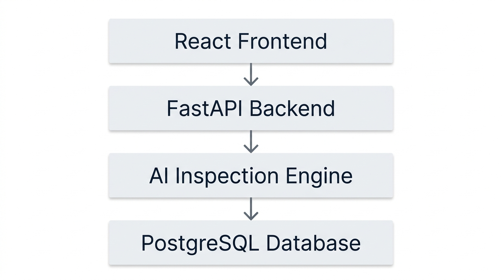
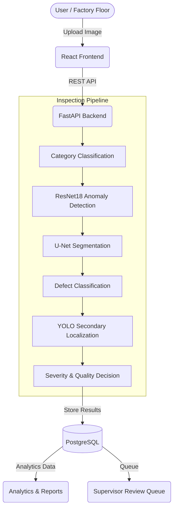
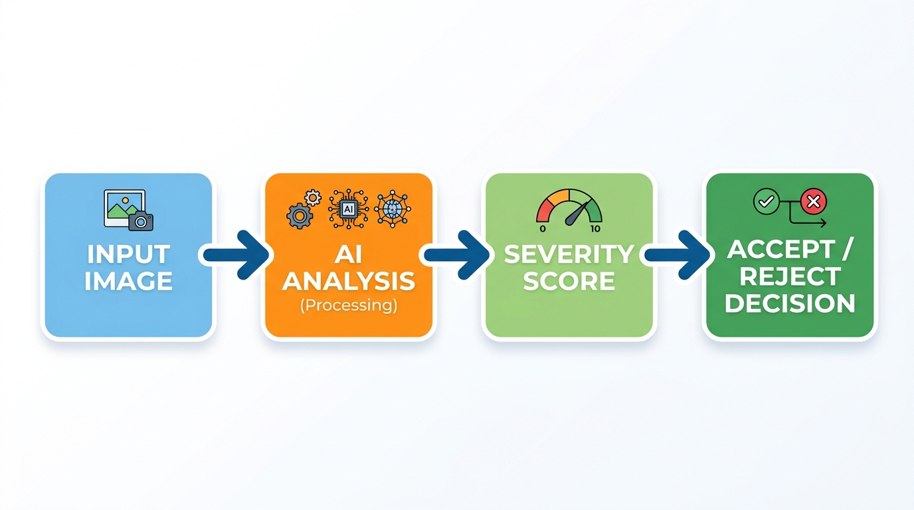
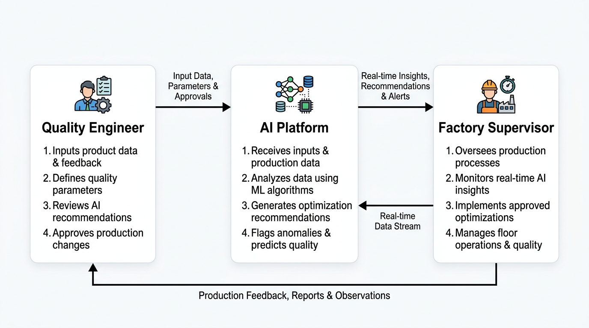

# VisionInspect AI

### AI-powered manufacturing defect detection and quality inspection

VisionInspect AI is an industrial quality control platform combining deep learning computer vision, automated severity scoring, and human-in-the-loop review. The system orchestrates a multi-stage AI pipeline to detect anomalies, segment defects, and issue automated Accept/Reject decisions, feeding all production data into a comprehensive reporting dashboard designed for Quality Engineers and Factory Supervisors.

[](https://python.org)
[](https://fastapi.tiangolo.com)
[](https://reactjs.org)
[](https://pytorch.org)
[](https://opencv.org/)
[](https://postgresql.org)
[](https://docker.com)
[](https://aws.amazon.com)

[🌐 Live Demo](http://3.27.27.79) | [📦 GitHub Repository](https://github.com/vinay98485/VisionInspect-AI)

*(Note: The live application is hosted on AWS EC2).*

---

## Project Overview

VisionInspect AI automates the visual inspection of manufactured products. Rather than relying on a single monolithic model, the platform uses a tiered computer vision pipeline to handle anomaly detection, pixel-level defect localization, and specific defect classification. The AI outputs are mathematically weighted to produce a standardized 0–100 severity score and an automated Accept/Reject quality decision.

The application is structured around a dual-role workflow: Quality Engineers manage day-to-day batch inspections, while Factory Supervisors audit the AI's automated decisions via a dedicated review queue, maintaining strict operational traceability.

## Key Features

- **JWT Authentication & RBAC**: Secure access for Quality Engineers and Factory Supervisors.
- **AI-Based Anomaly Detection**: ResNet18 feature extraction for baseline anomaly detection.
- **Defect Segmentation**: U-Net based sub-pixel defect localization.
- **Secondary Object Localization**: YOLO11n integration for discrete bounding-box counting.
- **Automated Severity Scoring**: Multi-factor algorithm weighing size, location, type, and confidence.
- **Quality Decision Engine**: Automated Accept/Reject routing based on calculated severity.
- **Supervisor Review Queue**: Dedicated workflow for supervisors to audit, approve, or override AI decisions.
- **Manufacturing Analytics**: Dashboards tracking inspection history, defect trends, and severity distributions.
- **Dockerized Deployment**: Fully containerized React/FastAPI/PostgreSQL stack.
- **AWS Infrastructure**: Validated for cloud deployment on Amazon EC2 via CPU-based PyTorch inference.

## System Architecture





## AI / Computer Vision Pipeline



The inspection pipeline evaluates images in sequential stages to synthesize a final quality decision:

1. **Category Classification**: (Optional) A customized ResNet18 model identifies the product category (e.g., bottle, pill) to route the image to the correct evaluation parameters.
2. **Anomaly Detection**: A deep feature memory bank utilizing ResNet18 Layer-3 embeddings compares the incoming image against known "normal" references to flag anomalies.
3. **Segmentation**: A U-Net architecture generates a pixel-level mask of the defective region, allowing the system to quantify defect area and location.
4. **Defect Classification**: A hierarchical ResNet18 model identifies the specific defect subtype (e.g., scratch, crack, contamination).
5. **Secondary Object Localization**: A YOLO11n one-class detector provides secondary bounding-box localization for discrete defect objects. This acts as a supplementary overlay, not the primary decision driver.
6. **Severity Calculation**: The pipeline combines the outputs into a standardized severity score.
7. **Quality Decision**: Evaluates the severity score against operational thresholds to issue an Accept/Reject recommendation.

*Note: Within the validated regression scope, confirmed normal specimens produced zero defect-region outputs in both the segmentation and localization stages.*

## Severity Scoring

The system employs a weighted formula to calculate an aggregate defect severity score.

**Severity Score Formula:**
`Severity Score = (Size × 30%) + (Location × 25%) + (Defect Type × 25%) + (Confidence × 20%)`

**Severity Levels:**
- **Critical:** 80–100
- **High:** 60–79
- **Medium:** 40–59
- **Low:** 0–39

**Quality Decision Mapping:**
The current operational parameters enforce a strict binary quality gate:
- **Low** → Accept
- **Medium**, **High**, **Critical** → Reject

## Quality Engineer & Supervisor Workflow


> **Quality and manufacturing workflow:** Factory supervisors can review AI-generated inspection results, approve or reject outcomes, and access production quality information.

**Quality Engineer Workflow:**
1. Log into the platform.
2. Upload a manufactured product image.
3. Execute the AI inspection.
4. Review the generated defect overlay, severity score, and automated quality decision.

**Factory Supervisor Workflow:**
1. Log into the platform with elevated credentials.
2. Access the Supervisor Review Queue.
3. Review pending inspections and the AI's automated decisions.
4. Formally Approve or Reject the inspection, attaching audit notes.
5. Monitor aggregate factory analytics and production quality reports.

## Analytics and Reporting

The platform includes a dedicated analytics engine tracking production quality. Dashboards display:
- Aggregate inspection statistics (Total, Accepted, Rejected).
- Defect distribution by category and subtype.
- Severity level distributions across production batches.
- Historical trend monitoring for quality drift.
- Actionable operational insights (e.g., identifying recurring defect patterns).

## Dataset

The **MVTec Anomaly Detection (MVTec AD)** dataset was utilized for the development, training, and evaluation of the computer vision models. The deployed application relies entirely on the trained model artifacts and does not require or bundle the MVTec dataset at runtime. 

## Model Validation

Validation was conducted through local regression testing and end-to-end AWS integration testing. 
- **Validations performed:** Category accuracy, normal vs. defective binary routing, correct segmentation masking, severity calculation boundaries, and normal-output invariance.
- **AWS parity:** The cloud deployment successfully reproduced the expected local runtime behavior without degradation.

## Model Performance & Limitations

While the pipeline accurately identifies and segments a wide range of defects, it has known operational limitations:
- **Subtle Anomalies:** The YOLO one-class formulation struggles with highly subtle, pixel-level anomalies (such as slight color shifts or microscopic cracks). The U-Net segmentation serves as the more robust ground truth for the severity engine.
- **Edge Cases:** During evaluation, a severely damaged transistor sample was incorrectly classified as "Normal" by the feature bank locally and on AWS. 

The current system prioritizes a validated end-to-end operational inspection workflow over continuous model retraining during this deployment phase. Addressing fine-grained defect edge cases represents a future ML-development iteration.

## Docker Deployment

The application is fully containerized using Docker Compose:
- **Frontend**: Multi-stage build (Node.js builder → Nginx production container).
- **Backend**: FastAPI running on Uvicorn (Python 3.11-slim base). Model artifacts are bind-mounted at runtime to keep image sizes small.
- **Database**: PostgreSQL 14 running on an internal Docker network, utilizing named volumes for data persistence.

## AWS Deployment

The system is deployed on an **AWS EC2** instance running Amazon Linux. 
- **Inference**: The PyTorch models execute using CPU-inference, which was validated as sufficient for the platform's API latency requirements.
- **Storage**: Model artifacts (~850 MB) reside directly on the EC2 EBS volume and are mounted into the backend container.
- **Networking**: The React frontend and FastAPI backend containers map directly to the host, with Nginx serving the UI to the public endpoint.

*Note: Environment-specific values (e.g., database credentials, JWT secrets, supervisor registration codes, and CORS origins) are injected via a `.env` file on the EC2 host and are never committed to version control.*

## Local Development

Ensure you have Docker and Docker Compose installed.

```bash
# 1. Clone the repository
git clone https://github.com/vinay98485/VisionInspect-AI.git
cd VisionInspect-AI

# 2. Configure environment variables
cp .env.example .env

# 3. Ensure required model weights are placed in ai/models/
# normal_features_layer3.pt, defect_segmenter_unet.pt

# 4. Build and run the stack
docker compose up --build
```
The frontend will be available at `http://localhost` and the backend API at `http://localhost:8000`.

## Project Structure

```text
VisionInspect_AI/
├── ai/
│   ├── evaluation/        # Validation scripts, regression suites
│   └── models/            # PyTorch models, scorers, pipelines, calibration files
├── backend/
│   ├── app/               # FastAPI application, database schemas, API routes, security
│   ├── tests/             # Backend unit and integration tests
│   ├── Dockerfile         # Backend container definition
│   └── requirements.txt   # Python dependencies
├── docs/                  # Project documentation and architecture diagrams
├── frontend/
│   ├── src/               # React application source (components, pages, services)
│   ├── Dockerfile         # Frontend container definition
│   └── nginx.conf         # Nginx production configuration
├── docker-compose.yml     # Full stack Docker Compose definition
└── README.md
```

## API / Backend

Key REST endpoints driving the platform:
- `POST /auth/register`: Register a new Quality Engineer or Supervisor.
- `POST /auth/login`: Authenticate and receive a JWT.
- `POST /images/upload`: Securely upload an image for inspection.
- `POST /images/{id}/inspect`: Trigger the asynchronous AI inspection pipeline.
- `GET /images/{id}`: Retrieve full inspection results and severity scores.

## Security & Configuration

The application is secured via JWT authentication and role-based access control (RBAC). 
- All environment-specific variables, database passwords, and signing secrets are managed via `.env`.
- **Never commit `.env`, AWS private keys, JWT tokens, or raw database credentials to version control.**

## Original Project Specification Alignment

| Requirement | Implementation |
|---|---|
| Authentication & RBAC | JWT + Quality Engineer / Factory Supervisor roles |
| Image acquisition | Direct image upload + backend validation |
| Defect detection | ResNet18 deep feature anomaly detection |
| Defect localization | U-Net segmentation + secondary YOLO bounding boxes |
| Defect classification | Hierarchical ResNet18 classifier |
| Severity scoring | Weighted severity formula (Size, Location, Type, Confidence) |
| Quality control | Automated Accept/Reject + Supervisor review workflow |
| Analytics | Real-time dashboard + trends + quality reporting |
| Docker deployment | Containerized via Docker Compose |
| Cloud deployment | Deployed to AWS EC2 (CPU Inference) |
| Final validation | Local regression suites + AWS E2E testing |

## Project Status

**Status: Deployed and validated**

- Core modules implemented.
- Docker deployment complete.
- AWS deployment complete.
- Quality Engineer & Factory Supervisor workflows verified.
- End-to-end AWS workflow verified.
- Reporting & Analytics verified.

## Author

**Vinay kumar**  
B.Tech — Computer Science and Engineering  
GitHub: [Vinay kumar](https://github.com/vinay98485)
